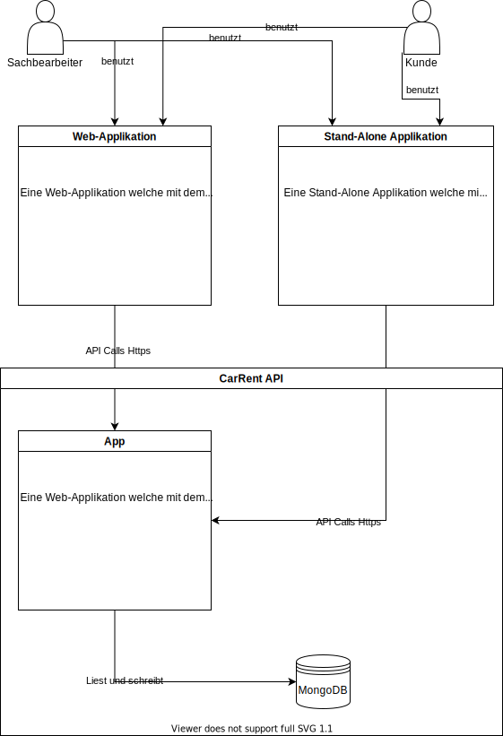
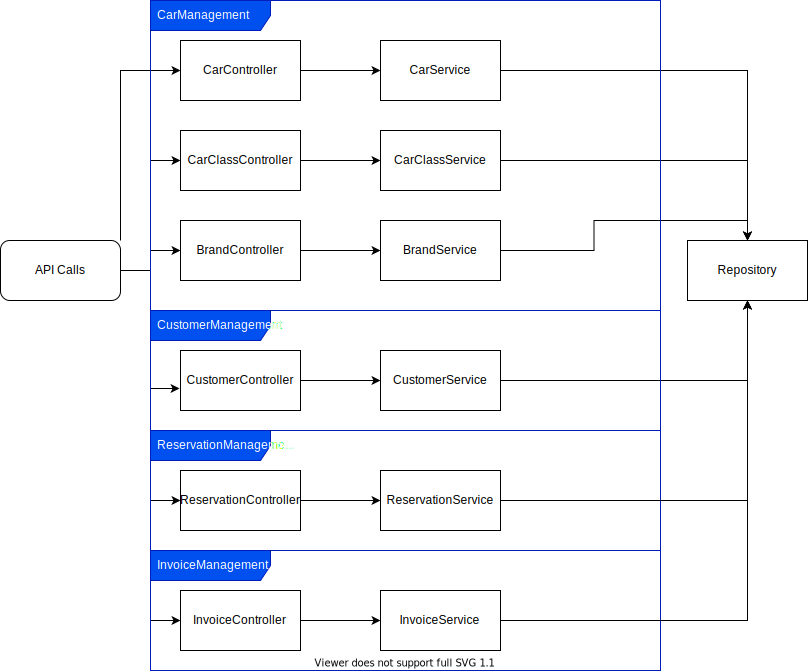

4C Pattern
========================

## Abgrenzungen
CarRent ist nur eine Reservierungssystem für Autos mit dem über eine API kommunziert werden kann.

Es hat **keine** Schnittstellen zu Fremdsystemenen.

## System Kontext

Kunden können in einer ersten Phase das System nur über einen Sachbearbeiter benutzen. Der Sachbearbeiter nimmt alle Interaktionen mit dem CarRent System via API vor.

In einer späteren Phase erhalten die Kunden ein eigenes Benutzerinterface. In diese können sie dann selbstständig Autos reservieren.

## Container Diagramm

Wir werden das Projekt in C# umsetzen und beim Datenbank-System haben wir uns für eine mongoDB entschieden.

In einer ersten Phase müssen wir uns nur um die CarRent API kümmen.

Für UI's wird ein neues Projekt eröffnet.

## Komponenten Diagramm

