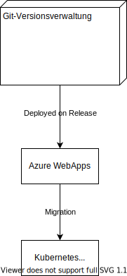

4+1
========================
## Deployment View

Bei einem Release soll die App automatisch via Azure ausgespielt werden und Migrationen an der Datenbank vorgenommen werden.
Dieser Workflow ist noch nicht erstellt.

[Weitere Informationen zu Deployment mit Github Actions](https://docs.microsoft.com/en-us/azure/app-service/deploy-github-actions?tabs=applevel)

## Logical View
### Container Diagram

### Klassendiagram

## Implementation View

Die Struktur des Source Folders:

* CarManagement
* CustomerManagement
* ReservationManagement
* InvoiceManagement
* Common

### Common
In dieser Namespace befinden sich alle Klassen welche von mehrer "Managements" verwendet wird.
Hier befindet sich auch das generische Repository.

### Aufbau Management / Common

#### Api
Hier befinden sich die Controller für die API.

#### Application
In diesem Namespace befinden sich die Services / Mapper und DTO's welche in diesem Management Bereich verwendet werden.

#### Domain
Hier befinden sich die Domain-Models für den Namespace Bereich

#### Infrastructure
Wird im Management Bereich noch nicht benötigt, hier könnte aber zum Beispiel ein Repository überschrieben bzw. erweitert werden.

